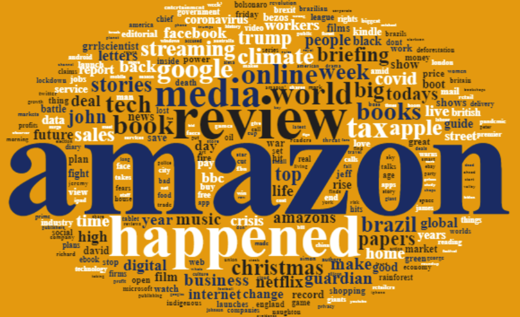
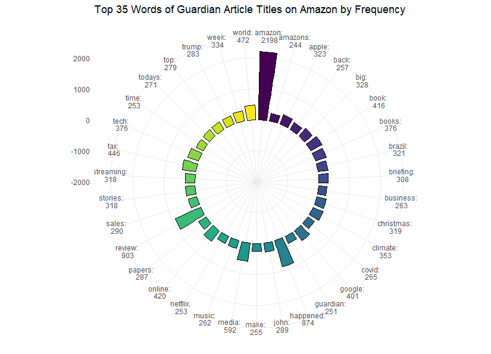
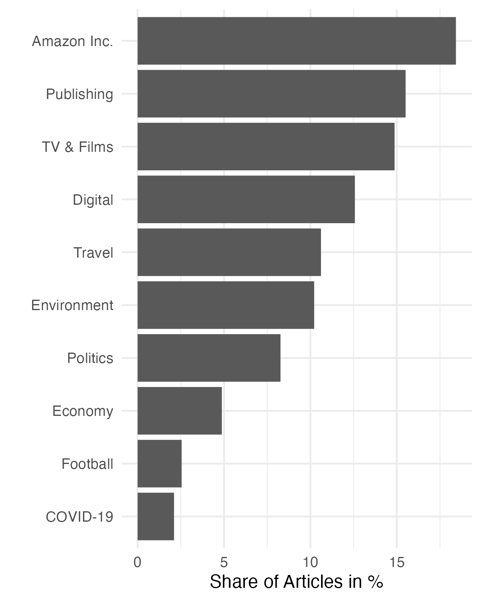

```{r setup, include=FALSE}
knitr::opts_chunk$set(echo = TRUE)

library(here)
library(knitr)
load("../terms_list.RData")
```

## Research Question
[enter text here]

## Hypothesis
[enter text here]

## Main Tests

### Named Entity Recognition
Our aim was to create a corpus of Guardian articles that only refer to the company Amazon, and not, e.g., the rainforest. In order to do this we performed Named Entity Recognition (NER) to remove articles that referenced instances of Amazon other than the company. The NER classifier we used has an [accuracy of around 90%](https://spacy.io/usage/facts-figures#benchmarks), so the corpus also includes articles that mention the rainforest. This impreciseness becomes visible in the world cloud and the topic modelling further below.

### Word Cloud
In the dataset of Guardian articles examined, the most frequently used word in article titles on the topic of Amazon is, unsurprisingly, the word "amazon" (see word cloud plot). It occurs in its base form ("amazon") 2198 times in the entire 23343 article titles. In addition, the declined and apostrophized forms of the word occur 244 times ("amazons") and 82 times ("amazon'"). A smaller proportion of these words can be associated not only with the largest online retailer, "Amazon," but also with environmental issues related to the words "brazil," "rainforest," "brazilian," "brazils," and "deforestation," which occur 321 and 117, 108, 106, and 97 times, respectively, in the Guardian article titles.

That a predominantly larger proportion of Amazon words can be associated with the online retailer giant is shown by the next most frequently used words: 'review' (903 times), 'happened' (874), 'media' (592), 'world' (472), 'tax' (446), 'online' (420), 'book & books' (416 & 376) (see frequency plot). From this, considerations can be formed in two directions: that Guardian is possibly running a massive advertising campaign for Amazon, or that Amazon is an established source of media consumption that attracts attention from large media houses like Guardian Media Group. However, to determine if the Guardian is running an ad campaign for Amazon or simply reporting on a popular topic, more information and further research is needed.

{width=75%}
{width=75%}

### Topic Modelling
We used Latent Dirichlet allocation (LDA) to form topic models of the articles in our Guardian corpus. We set the number of topics to be ten. Training the model on the corpus took several hours, which prevented us from trying out different numbers of topics. This could be an interesting hyper-parameter to play with in future work.

The following table displays the ten most important terms for each topic. Based on these terms, we named each topic manually.

```{r echo=FALSE}
kable(terms_list)
```

This figure displays the share of articles of each topic in our corpus. Unsurprisingly, articles referencing the company Amazon are the most common. The following three topics (Publishing, TV & Films, Digital) may refer to Amazon as a media giant, selling books, producing TV series and movies and offering digital services such as AWS. We see that around 10% of articles contain environmental references. This may include the Amazon rainforest, but perhaps also articles on the environmental impact of the company, due to its sheer size in the world. Why other the topics appear, such as Travel, Football or COVID-19 is currently unclear and would require further investigation.

{width=50%}


